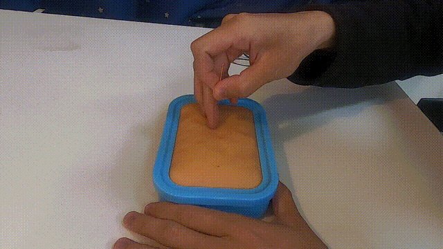
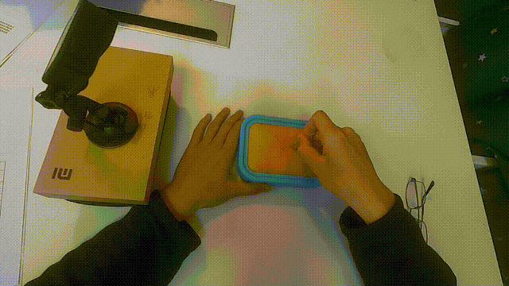
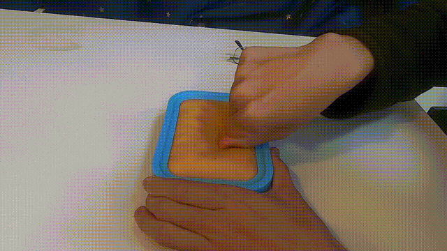
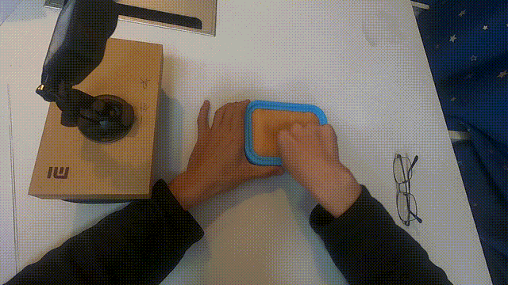

# Code Repository for the Paper  
**"Towards Cross-View Multimodality Action Quality Assessment for Traditional Chinese Medicine Physical Therapy"**

Currently, only the inference and training code is available now. Upon acceptance, the full proposed dataset will be released.

---

## Overview  

Vision-based **action quality assessment (AQA)** presents a promising solution for creating a more flexible action measurement tool in **Traditional Chinese Medicine (TCM)** physical therapy training. Current automatic AQA frameworks for rehabilitation typically focus on a single view using skeletal data, which proves inefficient for TCM physical therapy techniques such as acupuncture or *tui na*. These techniques often involve significant self-occlusion of the hands and complex hand-object interactions.

To address these limitations, we propose the **Cross-View Multimodality Enhanced AQA (CME-AQA)** framework to improve action quality assessment in TCM physical therapy training. Our framework is designed to mitigate self-occlusion issues and enhance the understanding of environmental contexts. Specifically, our approach integrates view translation for pose and visual modality features across different viewpoints. To evaluate our method, we assembled a dataset named **TCM-AQA61**, which includes first-person and third-person videos of 61 subjects performing acupuncture and Chinese massage. Experimental results demonstrate that our approach achieves superior performance across most metrics, with **over 30% higher accuracy and F1 scores** in key rating tasks such as *Needle Depth* and *Quick Needle Movements*.  

Overall, the **CME-AQA** framework significantly enhances the precision of action quality assessment in TCM training by addressing challenges related to self-occlusion and limited environmental awareness.

---
## Example Data

<p align="center">
  
  
</p>

<p align="center">
  <em>Left:</em> Third-person perspective of an acupuncture practice session.<br>
  <em>Right:</em> First-person view simulating the practitioner's perspective during acupuncture.
</p>

**🔗 Downloads:**
- [Download third-person video](https://github.com/FrancisXZhang/cme-aqa/raw/main/Sample_Videos_and_Labels/1_0_0.MP4)
- [Download first-person video](https://github.com/FrancisXZhang/cme-aqa/raw/main/Sample_Videos_and_Labels/2_0_0.MP4)

<p align="center">
  
  
</p>

---

## Example Code  

```bash
python Trainer_Fusion.py --fpv_json output_p/A_TPV \
                         --tpv_json output_p/A_FPV \
                         --fpv_f output_v/A_TPV \
                         --tpv_f output_v/A_FPV \
                         --label_file Accu.csv \
                         --model_script Ablation_Model.CAT_PoseTrans_Dense_l4_EarlyShare \
                         --model_class Model \
                         --log_file Ablation_Result/CAT_PoseTrans_Dense_l4_EarlyShare.log
