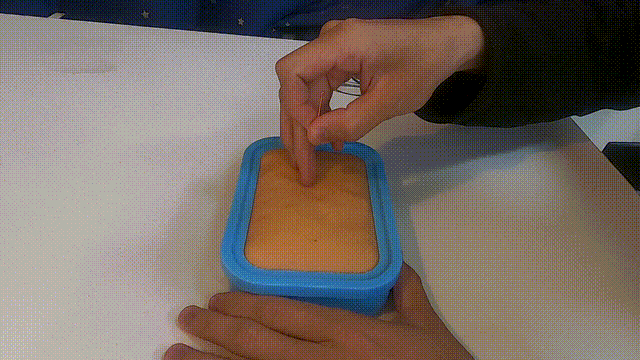
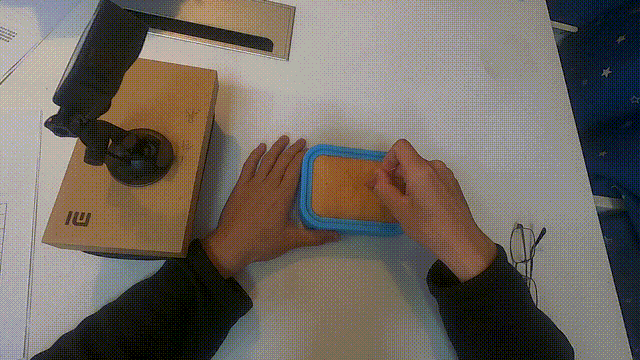
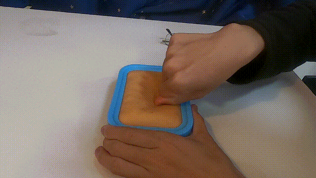
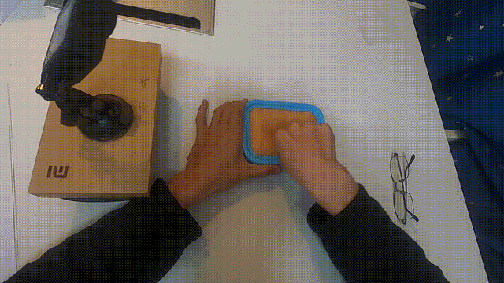

# Code Repository for the Paper  
**"Towards Cross-View Multimodality Action Quality Assessment for Traditional Chinese Medicine Physical Therapy"**

Currently, only the inference and training code is available now. Upon acceptance, the full proposed dataset will be released.

The TCM-AQA61 dataset can be downloaded from this SharePoint folder:
[Download TCM-AQA61 dataset](https://uoe-my.sharepoint.com/:f:/g/personal/xzhang19_ed_ac_uk/IgCGdBQc224ZQJkrLLi3w86zAbxREoC22jJFyZw-61-3hs0?e=vHQwtu).

---

## Overview  

Vision-based **action quality assessment (AQA)** presents a promising solution for creating a more flexible action measurement tool in **Traditional Chinese Medicine (TCM)** physical therapy training. Current automatic AQA frameworks for rehabilitation typically focus on a single view using skeletal data, which proves inefficient for TCM physical therapy techniques such as acupuncture or *tui na*. These techniques often involve significant self-occlusion of the hands and complex hand-object interactions.

To address these limitations, we propose the **Cross-View Multimodality Enhanced AQA (CME-AQA)** framework to improve action quality assessment in TCM physical therapy training. Our framework is designed to mitigate self-occlusion issues and enhance the understanding of environmental contexts. Specifically, our approach integrates view translation for pose and visual modality features across different viewpoints. To evaluate our method, we assembled a dataset named **TCM-AQA61**, which includes first-person and third-person videos of 61 subjects performing acupuncture and Chinese massage. Experimental results demonstrate that our approach achieves superior performance across most metrics, with **over 30% higher accuracy and F1 scores** in key rating tasks such as *Needle Depth* and *Quick Needle Movements*.  

Overall, the **CME-AQA** framework significantly enhances the precision of action quality assessment in TCM training by addressing challenges related to self-occlusion and limited environmental awareness.

---
## Example Videos from the Dataset

### Acupuncture Example Videos
<p align="center">
  
  
</p>

<p align="center">
  <em>Left:</em> Third-person perspective of an acupuncture practice session.<br>
  <em>Right:</em> First-person view simulating the practitioner's perspective during acupuncture.
</p>

**Label for this case:**
| Video_Side | Video_Head | NeedleHolding | Angle | Depth | Fast | InsertionFrequency | InsertionAmplitude | TwistingFrequency | TwistingAmplitude | FastWithdrawal |
|------------|------------|----------------|-------|--------|------|---------------------|---------------------|--------------------|--------------------|----------------|
| 1_0_0      | 2_0_0      | 1              | 1     | 1      | 1    | 0                   | 1                   | 1                  | 1                  | 1              |


**Downloads:** [Download third-person video](https://github.com/FrancisXZhang/cme-aqa/raw/main/Sample_Videos_and_Labels/1_0_0.MP4), [Download first-person video](https://github.com/FrancisXZhang/cme-aqa/raw/main/Sample_Videos_and_Labels/2_0_0.MP4)


### Tuina Example Videos
<p align="center">
  
  
</p>

<p align="center">
  <em>Left:</em> Third-person perspective of a Tui Na (Chinese therapeutic massage) session.<br>
  <em>Right:</em> First-person view from the practitioner performing Tui Na techniques.
</p>

**Label for this case:**
| Video_Side | Video_Head | Action | PalmEmpty | FingerSolid | Slow | Depth | Frequency |
|------------|------------|--------|------------|--------------|------|--------|-----------|
| 1_1_0      | 2_1_0      | 1      | 0          | 1            | 0    | 0      | 1         |

**Downloads:** [Download third-person video](https://github.com/FrancisXZhang/cme-aqa/raw/main/Sample_Videos_and_Labels/1_1_0.MP4), [Download first-person video](https://github.com/FrancisXZhang/cme-aqa/raw/main/Sample_Videos_and_Labels/2_1_0.MP4)

---

## Example Code  

```bash
python Trainer_Fusion.py --fpv_json output_p/A_TPV \
                         --tpv_json output_p/A_FPV \
                         --fpv_f output_v/A_TPV \
                         --tpv_f output_v/A_FPV \
                         --label_file Accu.csv \
                         --model_script Ablation_Model.CAT_PoseTrans_Dense_l4_EarlyShare \
                         --model_class Model \
                         --log_file Ablation_Result/CAT_PoseTrans_Dense_l4_EarlyShare.log


```

## Demonstration of Assessing Different Skill Levels

<p align="center">
  
  
  
</p>

<p align="center">
  <em>Left to right:</em> Low, Mid, and High skill level participants as assessed by our framework.
</p>

>*The table shown at the top of each video displays the output of our framework compared to baseline methods. You may click on the GIF to enlarge it and clearly observe the differences.*

**Downloads:** [Low Skill (MP4)](https://github.com/FrancisXZhang/cme-aqa/raw/main/Demo_Videos/Low_Skill.mp4), [Mid Skill (MP4)](https://github.com/FrancisXZhang/cme-aqa/raw/main/Demo_Videos/Mid_Skill.mp4), [High Skill (MP4)](https://github.com/FrancisXZhang/cme-aqa/raw/main/Demo_Videos/High_Skill.mp4)


---

## Clean Classification Training Workflow

This repository also includes a tidied package-style classification workflow under `src/`
with executable scripts under `tools/`. This is intended for the class-based CME-AQA
experiments where per-class accuracy, precision, recall, F1, macro F1, and weighted F1
are the primary metrics.

```text
src/cme_aqa/
  dataset/       # dual-view pose JSON and visual feature dataset
  model/         # CAT fusion model variants
  training/      # classification trainer and metrics
  utils/         # reproducibility helpers
tools/
  train_classification.py
  infer_classification.py
  run_ours_class.bat
  run_ours_class_tuina.bat
```

### Accu Classification

From the repository root:

```bat
set PYTHON=C:\Users\Xiati\anaconda3\envs\torch-gpu\python.exe
set CME_AQA_DATA_ROOT=E:\NCC\TCM_AQA
tools\run_ours_class.bat
```

This mirrors the historical `OursClass.bat` setup using
`CAT_PoseTrans_Dense_l2_EarlyShare` on the acupuncture labels.

### Tuina Classification

```bat
set PYTHON=C:\Users\Xiati\anaconda3\envs\torch-gpu\python.exe
set CME_AQA_DATA_ROOT=E:\NCC\TCM_AQA
tools\run_ours_class_tuina.bat
```

### Direct Python Entry Point

```bat
python tools\train_classification.py ^
  --fpv_json E:\NCC\TCM_AQA\output_p\A_FPV ^
  --tpv_json E:\NCC\TCM_AQA\output_p\A_TPV ^
  --fpv_f E:\NCC\TCM_AQA\output_v\A_FPV ^
  --tpv_f E:\NCC\TCM_AQA\output_v\A_TPV ^
  --label_file E:\NCC\TCM_AQA\Accu_extended.csv ^
  --out_dir E:\NCC\TCM_AQA\repo\runs\class_accu ^
  --model_variant l2 ^
  --num_classes 9 ^
  --num_epochs 20
```

Training writes `metrics.csv`, `summary.json`, and fold checkpoints under the selected
`--out_dir`. Generated runs, checkpoints, logs, and caches are intentionally ignored by
Git.

---

## Citation

If you use this repository, please cite:

```bibtex
@article{zhang26cross,
 author={Zhang, Francis Xiatian and Yao, Hao and Chen, Shengxuan and Zhu, Hong and Jia, Hongxiao and Zheng, Sisi and Shum, Hubert P. H.},
 journal={IEEE Transactions on Neural Systems and Rehabilitation Engineering},
 title={Cross-view Multimodal Vision-Based Assessment Framework for Traditional Chinese Medicine Rehabilitation Training},
 year={2026},
 doi={10.1109/TNSRE.2026.3705649},
 publisher={IEEE},
}
```
